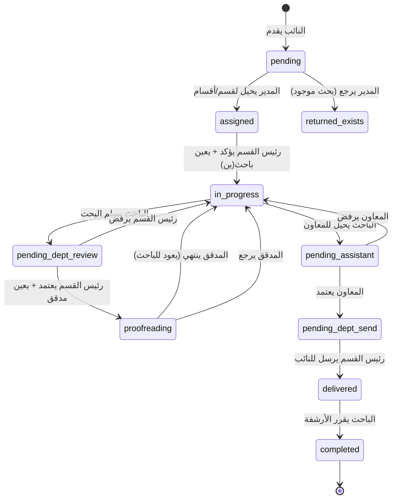

# 🔄 سير العمل التفصيلي - Business Workflow

## نظرة عامة

كل طلب بحثي يمر بـ **state machine** صارمة من 12 حالة، يتم الانتقال بينها
عبر إجراءات محددة من أدوار محددة.

---

## State Machine



---

## الحالات بالتفصيل

| الحالة | المعنى | من ينقلها |
|------|------|----------|
| `pending` | انتظار التوجيه | المدير |
| `assigned` | محال لقسم/أقسام | رئيس القسم |
| `confirmed` | مؤكد (مرحلة انتقالية) | تلقائي |
| `in_progress` | قيد الإعداد | الباحث |
| `pending_dept_review` | مراجعة رئيس القسم | رئيس القسم |
| `proofreading` | قيد المدقق اللغوي | المدقق |
| `pending_assistant` | بانتظار المعاون | المعاون |
| `pending_dept_send` | بانتظار إرسال رئيس القسم | رئيس القسم |
| `delivered` | مُسلَّم للنائب | الباحث (قرار الأرشفة) |
| `completed` | مكتمل | - (نهائي) |
| `returned_exists` | لا يمكن التنفيذ (بحث موجود) | - (نهائي) |
| `rejected` | مرفوض | - (نهائي) |

---

## التدفق الكامل خطوة بخطوة

### 1️⃣ النائب يقدم الطلب

**الفاعل**: نائب
**Endpoint**: `POST /api/requests`

```
Input: عنوان + وصف + غرض + اللجنة (من القائمة الـ 23) + موافقة النشر
Output: REQ-XXX (status=pending)
Side effects:
  - INSERT into requests
  - INSERT into activity_logs
```

---

### 2️⃣ المدير يحيل لقسم (أو أقسام)

**الفاعل**: مدير الدائرة
**Endpoint**: `PUT /api/requests/{id}/assign`

```
Input: department_ids = ["research", "budget_research"]
Validation: الطلب status='pending'
Transitions: pending → assigned

Side effects:
  - UPDATE requests SET status='assigned', assigned_department=primary
  - DELETE FROM request_departments WHERE request_id=...
  - INSERT INTO request_departments لكل قسم
  - INSERT INTO activity_logs
  - INSERT INTO notifications لكل رئيس قسم
```

⭐ **ميزة جديدة**: يمكن إحالة نفس الطلب لأكثر من قسم.

---

### 3️⃣ رئيس القسم يؤكد ويعين باحث(ين)

**الفاعل**: رئيس القسم
**Endpoint**: `PUT /api/requests/{id}/confirm`

```
Input: service_type + classification + completion_days + researcher_ids=[13,15]
Validation:
  - الطلب assigned_department يطابق قسم رئيس القسم
  - completion_days بين 1 و 365
Transitions: assigned → in_progress

Side effects:
  - INSERT INTO request_confirmations
  - INSERT INTO research_tasks (مهمة لكل باحث)
  - UPDATE requests SET status='in_progress'
  - INSERT INTO activity_logs
  - INSERT INTO notifications لكل باحث
```

⭐ **ميزة جديدة**: يمكن تعيين أكثر من باحث على نفس الطلب.

---

### 4️⃣ الباحث يعمل + يطلب معلومات

**الفاعل**: الباحث
**Endpoints**:
- `PUT /api/research-tasks/{id}/status` (in_progress)
- `POST /api/research-tasks/{id}/info-requests` (الحد: 3 محاولات)
- `PUT /api/information-requests/{id}/response` (تحديث رد الجهة)

```
أثناء العمل:
  - الباحث يكتب البحث
  - يرسل ما يصل لـ 3 طلبات معلومات للجهات الرسمية
  - يحدث ردود الجهات
```

---

### 5️⃣ الباحث يسلم البحث

**الفاعل**: الباحث
**Endpoint**: `PUT /api/research-tasks/{id}/status`

```
Input: status='submitted'
Transitions:
  - research_task: in_progress → submitted
  - request: in_progress → pending_dept_review ⭐
Side effects:
  - INSERT INTO notifications لرئيس القسم
```

---

### 6️⃣ ⭐ رئيس القسم يراجع (workflow جديد)

**الفاعل**: رئيس القسم
**Endpoint**: `PUT /api/requests/{id}/dept-review`

```
Input: decision=approve|reject, proofreader_id (عند approve), notes
Validation: الطلب pending_dept_review + يخص قسم رئيس القسم

عند approve:
  Transitions: pending_dept_review → proofreading
  Side effects:
    - INSERT INTO proofreading_tasks (مع proofreader_id المختار)
    - UPDATE research_tasks SET status='sent_to_proofreader'
    - INSERT INTO notifications للمدقق

عند reject:
  Transitions: pending_dept_review → in_progress
  Side effects:
    - INSERT INTO notes
    - INSERT INTO notifications للباحث
```

---

### 7️⃣ المدقق اللغوي يدقق

**الفاعل**: المدقق اللغوي
**Endpoint**: `PUT /api/proofreading-tasks/{id}/status`

```
Input: status='completed', notes
Transitions:
  - proofreading_task: pending|in_progress → completed
  - research_task: sent_to_proofreader → submitted
  - request: proofreading → in_progress ⭐
Side effects:
  - INSERT INTO notifications للباحث (للإحالة للمعاون)
```

⭐ **ملاحظة**: الـ request يعود إلى `in_progress` حتى يستطيع الباحث الإحالة
يدوياً للمعاون (workflow جديد - req.md).

---

### 8️⃣ ⭐ الباحث يحيل للمعاون

**الفاعل**: الباحث
**Endpoint**: `PUT /api/research-tasks/{id}/refer-assistant`

```
Validation: الطلب في in_progress + الباحث هو المسؤول عن المهمة
Transitions: in_progress → pending_assistant
Side effects:
  - INSERT INTO notifications لكل المعاونين النشطين
```

---

### 9️⃣ ⭐ المعاون يدقق نهائياً (دور جديد)

**الفاعل**: المعاون (`assistant_manager`)
**Endpoint**: `PUT /api/requests/{id}/assistant-review`

```
Input: decision=approve|reject, notes

عند approve:
  Transitions: pending_assistant → pending_dept_send
  Side effects:
    - UPDATE requests SET assistant_review_by=userID, assistant_review_date=now
    - INSERT INTO notifications لرئيس قسم الطلب

عند reject:
  Transitions: pending_assistant → in_progress
  Side effects:
    - INSERT INTO notes (سبب الرفض)
    - INSERT INTO notifications للباحث(ين)
```

---

### 🔟 ⭐ رئيس القسم يرسل للنائب

**الفاعل**: رئيس القسم
**Endpoint**: `PUT /api/requests/{id}/dept-send`

```
Validation:
  - الطلب pending_dept_send
  - assigned_department يطابق قسم رئيس القسم
Transitions: pending_dept_send → delivered

Side effects:
  - UPDATE requests SET status='delivered', completed_date=now,
    delivered_to_deputy_date=now, final_review_by=userID
  - INSERT INTO notifications للنائب
  - 📱 SMS hook للنائب (log فقط حالياً، يحتاج SMS gateway)
  - INSERT INTO notifications لكل الباحثين (لأخذ موافقة الأرشفة)
```

---

### 1️⃣1️⃣ الباحث يقرر الأرشفة

**الفاعل**: الباحث
**Endpoint**: `PUT /api/research-tasks/{id}/archive-consent`

```
Input: consent=approved|rejected, notes
Validation: الطلب delivered أو completed

عند approved:
  Side effects:
    - UPDATE research_tasks SET archive_consent='approved', status='completed'
    - UPDATE requests SET archived=1, status='completed'

عند rejected:
  Side effects:
    - UPDATE research_tasks SET archive_consent='rejected', status='completed'
    - UPDATE requests SET archived=0, status='completed'
```

---

## مسارات إضافية

### المدير يرجع الطلب (لا يمكن التنفيذ)

```
الفاعل: المدير
Endpoint: PUT /api/requests/{id}/return
Transitions: pending → returned_exists
```

### تعديل دور المدير (متوافق مع القديم)

النظام يدعم Final Review من المدير عبر `PUT /api/requests/{id}/final-review`
للتوافق مع التدفق القديم. لكن الـ workflow الجديد يستبدله بـ:
`pending_dept_review` → `pending_assistant` → `pending_dept_send`.

---

## الإشعارات (Notifications)

كل انتقال state ينتج عنه إشعار للمستخدم(ين) المعنيين:

| الحدث | المستلم |
|------|--------|
| إحالة لقسم | رؤساء الأقسام المُحالة لها |
| تعيين باحث | الباحث المُعيَّن |
| تسليم البحث | رئيس القسم |
| اعتماد + إرسال للتدقيق | المدقق اللغوي |
| اكتمال التدقيق | الباحث |
| إحالة للمعاون | كل المعاونين النشطين |
| اعتماد المعاون | رئيس قسم الطلب |
| إرسال للنائب | النائب (in-app + 📱 SMS hook) |
| طلب الأرشفة | الباحث |

---

## القيود (Invariants)

1. ⛔ الطلب لا يمكن إحالته إلا إذا كان `pending` أو `assigned`
2. ⛔ رئيس القسم يرى/يعدل طلبات قسمه فقط
3. ⛔ الباحث يرى/يعدل مهامه فقط
4. ⛔ الحد الأقصى **3 محاولات** لطلب المعلومات لكل مهمة
5. ⛔ موافقة الأرشفة تتطلب أن يكون الطلب `delivered`
6. ⛔ التدقيق النهائي للمعاون يتطلب `pending_assistant` حصراً
7. ⛔ الإرسال للنائب يتطلب `pending_dept_send` حصراً

كل القيود مفروضة في الـ backend عبر validation + transactions.
