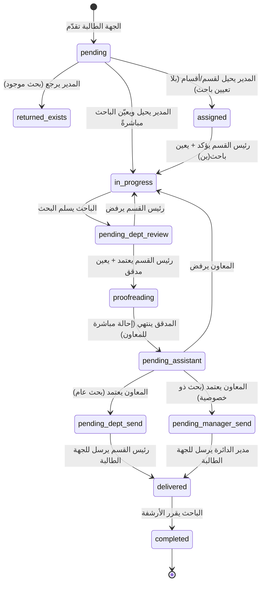

# 🔄 سير العمل التفصيلي - Business Workflow

## نظرة عامة

كل طلب بحثي يمر بـ **state machine** صارمة، يتم الانتقال بين حالاتها
عبر إجراءات محددة من أدوار محددة.

**مسار التسليم يتفرّع حسب تصنيف السرية** (`requests.confidentiality`):
البحث `public` يُسلَّم للجهة الطالبة عبر **رئيس القسم**، والبحث `confidential`
يُسلَّم عبرها **مدير الدائرة**. يحدد التصنيفَ الطالبُ عند التقديم، ويستطيع
المعاون تصحيحه عند التدقيق النهائي.

---

## State Machine



---

## الحالات بالتفصيل

| الحالة | المعنى | من ينقلها |
|------|------|----------|
| `pending` | انتظار التوجيه | المدير |
| `assigned` | محال لقسم/أقسام | رئيس القسم |
| `confirmed` | مؤكد (مرحلة انتقالية — غير مستخدمة حالياً) | تلقائي |
| `in_progress` | قيد الإعداد | الباحث |
| `pending_dept_review` | مراجعة رئيس القسم | رئيس القسم |
| `proofreading` | قيد المدقق اللغوي | المدقق |
| `pending_assistant` | بانتظار المعاون | المعاون |
| `pending_dept_send` | بانتظار إرسال رئيس القسم (بحث عام) | رئيس القسم |
| `pending_manager_send` | بانتظار إرسال مدير الدائرة (بحث ذو خصوصية) | مدير الدائرة |
| `delivered` | مُسلَّم للجهة الطالبة | الباحث (قرار الأرشفة) |
| `completed` | مكتمل | - (نهائي) |
| `returned_exists` | لا يمكن التنفيذ (بحث موجود) | - (نهائي) |
| `rejected` | مرفوض | - (نهائي) |

---

## الجهات الطالبة

الطلبات تُستلَم من ست جهات، كلها تحمل `role='deputy'` وتستخدم بوابة تقديم
الطلبات نفسها، ويميّزها الحقل `users.requester_type` (يُنسَخ على الطلب وقت التقديم):

| القيمة | الجهة |
|------|------|
| `deputy` | نواب |
| `presidency` | رئاسات |
| `committee` | لجان |
| `bloc_leader` | رؤساء الكتل |
| `director` | مدراء |
| `advisor` | مستشارين |

---

## التدفق الكامل خطوة بخطوة

### 1️⃣ النائب يقدم الطلب

**الفاعل**: نائب
**Endpoint**: `POST /api/requests`

```
Input: عنوان + وصف + غرض + اللجنة (من القائمة الـ 23) + موافقة النشر
Output: REQ-XXX (status=pending)
Side effects:
  - INSERT into requests
  - INSERT into activity_logs
```

---

### 2️⃣ المدير يحيل لقسم (أو أقسام) — ويمكنه تعيين الباحث

**الفاعل**: مدير الدائرة
**Endpoint**: `PUT /api/requests/{id}/assign`

```
Input:
  department_ids = ["research", "budget_research"]
  # اختياري — التعيين المباشر:
  researcher_ids = [13, 15]
  service_type, classification, completion_days

Validation:
  - الطلب status ∈ ('pending', 'assigned')
  - عند التعيين المباشر: الباحثون نشطون وينتمون لأحد الأقسام المُحالة
  - عند التعيين المباشر: لا توجد مهام بحث قائمة للطلب

Transitions:
  بلا باحثين → assigned   (يتولى رئيس القسم التعيين)
  مع باحثين  → in_progress (يبدأ العمل مباشرةً)

Side effects:
  - UPDATE requests SET status=..., assigned_department=primary
  - DELETE ثم INSERT INTO request_departments لكل قسم
  - عند التعيين المباشر: INSERT OR REPLACE INTO request_confirmations
    + INSERT INTO research_tasks (مهمة لكل باحث)
  - INSERT INTO activity_logs
  - INSERT INTO notifications لرؤساء الأقسام (وللباحثين عند التعيين)
```

⭐ يمكن إحالة نفس الطلب لأكثر من قسم — ورئيس **أي** قسم من الأقسام المُحالة
يستطيع التأكيد والمراجعة والإرسال (وليس القسم الرئيسي وحده).

---

### 2️⃣ب تعديل بيانات الطلب

**الفاعل**: مدير الدائرة
**Endpoint**: `PUT /api/requests/{id}`

```
Input: title, description, purpose, committee, deadline, can_share, confidentiality
       (كل الحقول اختيارية — غير المُرسَل يبقى كما هو)
Validation: الطلب ليس delivered/completed/returned_exists/rejected
Side effects:
  - UPDATE requests
  - INSERT INTO notes (أثر التعديل)
  - INSERT INTO activity_logs
```

---

### 3️⃣ رئيس القسم يؤكد ويعين باحث(ين)

**الفاعل**: رئيس القسم
**Endpoint**: `PUT /api/requests/{id}/confirm`

```
Input: service_type + classification + completion_days + researcher_ids=[13,15]
Validation:
  - الطلب assigned_department يطابق قسم رئيس القسم
  - completion_days بين 1 و 365
Transitions: assigned → in_progress

Side effects:
  - INSERT INTO request_confirmations
  - INSERT INTO research_tasks (مهمة لكل باحث)
  - UPDATE requests SET status='in_progress'
  - INSERT INTO activity_logs
  - INSERT INTO notifications لكل باحث
```

⭐ **ميزة جديدة**: يمكن تعيين أكثر من باحث على نفس الطلب.

---

### 4️⃣ الباحث يعمل + يطلب معلومات

**الفاعل**: الباحث
**Endpoints**:
- `PUT /api/research-tasks/{id}/status` (in_progress)
- `POST /api/research-tasks/{id}/info-requests` (الحد: 3 محاولات)
- `PUT /api/information-requests/{id}/response` (تحديث رد الجهة)

```
أثناء العمل:
  - الباحث يكتب البحث ويرفع ملفه (PDF/DOC/DOCX حتى 10MB)
  - يسجّل ما يصل لـ 3 كتب مخاطبة رسمية، ولكل كتاب:
      target_entity  جهة المخاطبة   (مطلوب)
      subject        موضوع الكتاب   (مطلوب)
      number         رقم الكتاب     (اختياري — يُولَّد تلقائياً إن تُرك فارغاً)
      letter_date    تاريخ الكتاب   (اختياري — تاريخ اليوم افتراضياً)
  - يحدّث ردود الجهات (رقم كتاب الرد + تاريخه)
```

⛔ الباحث يسجّل مخاطبات **مهامه فقط** (تحقق ملكية على الـ endpoint).

---

### 5️⃣ الباحث يسلم البحث

**الفاعل**: الباحث
**Endpoint**: `PUT /api/research-tasks/{id}/status`

```
Input: status='submitted'
Transitions:
  - research_task: in_progress → submitted
  - request: in_progress → pending_dept_review ⭐
Side effects:
  - INSERT INTO notifications لرئيس القسم
```

---

### 6️⃣ ⭐ رئيس القسم يراجع (workflow جديد)

**الفاعل**: رئيس القسم
**Endpoint**: `PUT /api/requests/{id}/dept-review`

```
Input: decision=approve|reject, proofreader_id (عند approve), notes
Validation: الطلب pending_dept_review + يخص قسم رئيس القسم

عند approve:
  Transitions: pending_dept_review → proofreading
  Side effects:
    - INSERT INTO proofreading_tasks (مع proofreader_id المختار)
    - UPDATE research_tasks SET status='sent_to_proofreader'
    - INSERT INTO notifications للمدقق

عند reject:
  Transitions: pending_dept_review → in_progress
  Side effects:
    - INSERT INTO notes
    - INSERT INTO notifications للباحث
```

---

### 7️⃣ المدقق اللغوي يدقق ← ثم يحيل للمعاون مباشرةً

**الفاعل**: المدقق اللغوي
**Endpoint**: `PUT /api/proofreading-tasks/{id}/status`

```
Input: status='completed', notes
Transitions:
  - proofreading_task: pending|in_progress → completed
  - research_task: sent_to_proofreader → submitted
  - request: proofreading → pending_assistant ⭐
Side effects:
  - INSERT INTO notifications لكل المعاونين النشطين
  - INSERT INTO notifications للباحث (للعلم)
```

⭐ **تغيير**: البحث ينتقل من المدقق اللغوي إلى المعاون **مباشرةً**، بلا خطوة
وسيطة عند الباحث. المسار القديم (`refer-assistant`) ما زال متاحاً للتوافق.

---

### 8️⃣ إعادة إسناد المهمة لباحث بديل (عند الحاجة)

**الفاعل**: رئيس القسم أو مدير الدائرة
**Endpoint**: `PUT /api/research-tasks/{id}/reassign`

```
Input: researcher_id (البديل), notes (سبب النقل)
Validation:
  - المهمة ليست completed
  - الباحث البديل نشط ودوره researcher
  - رئيس القسم مقيَّد بباحثي قسمه؛ مدير الدائرة غير مقيد
Side effects:
  - UPDATE research_tasks SET researcher_id=البديل
    (المهمة تُنقل بمحتواها: الملف والمخاطبات والملاحظات)
  - INSERT INTO notes (أثر التسليم)
  - INSERT INTO notifications للباحثَين القديم والجديد
```

---

### 9️⃣ المعاون يدقق نهائياً ويوجّه حسب السرية

**الفاعل**: المعاون (`assistant_manager`)
**Endpoint**: `PUT /api/requests/{id}/assistant-review`

```
Input: decision=approve|reject, notes, confidentiality (اختياري — تصحيح التصنيف)

عند approve:
  Transitions:
    confidentiality='public'       → pending_dept_send    (رئيس القسم)
    confidentiality='confidential' → pending_manager_send (مدير الدائرة)
  Side effects:
    - UPDATE requests SET status=..., confidentiality=...,
      assistant_review_by=userID, assistant_review_date=now
    - INSERT INTO notifications لرؤساء القسم أو لمدراء الدائرة حسب المسار

عند reject:
  Transitions: pending_assistant → in_progress
  Side effects:
    - INSERT INTO notes (سبب الرفض)
    - INSERT INTO notifications للباحث(ين)
```

---

### 🔟 التسليم للجهة الطالبة — مساران

**البحث العام** — الفاعل: رئيس القسم · `PUT /api/requests/{id}/dept-send`
```
Validation: الطلب pending_dept_send + قسم المستخدم من الأقسام المُحالة
```

**البحث ذو الخصوصية** — الفاعل: مدير الدائرة · `PUT /api/requests/{id}/manager-send`
```
Validation: الطلب pending_manager_send
```

كلا المسارين ينفّذان المنطق نفسه (`deliverToDeputy`):
```
Transitions: → delivered
Side effects:
  - UPDATE requests SET status='delivered', completed_date=now,
    delivered_to_deputy_date=now, final_review_by=userID
  - INSERT INTO notifications للجهة الطالبة
  - 📱 SMS hook (log فقط حالياً، يحتاج SMS gateway)
  - INSERT INTO notifications لكل الباحثين (لأخذ موافقة الأرشفة)
```

---

### 1️⃣1️⃣ الباحث يقرر الأرشفة

**الفاعل**: الباحث
**Endpoint**: `PUT /api/research-tasks/{id}/archive-consent`

```
Input: consent=approved|rejected, notes
Validation: الطلب delivered أو completed

عند approved:
  Side effects:
    - UPDATE research_tasks SET archive_consent='approved', status='completed'
    - UPDATE requests SET archived=1, status='completed'

عند rejected:
  Side effects:
    - UPDATE research_tasks SET archive_consent='rejected', status='completed'
    - UPDATE requests SET archived=0, status='completed'
```

---

## مسارات إضافية

### المدير يرجع الطلب (لا يمكن التنفيذ)

```
الفاعل: المدير
Endpoint: PUT /api/requests/{id}/return
Transitions: pending → returned_exists
```

### تعديل دور المدير (متوافق مع القديم)

النظام يدعم Final Review من المدير عبر `PUT /api/requests/{id}/final-review`
للتوافق مع التدفق القديم. لكن الـ workflow الجديد يستبدله بـ:
`pending_dept_review` → `pending_assistant` → `pending_dept_send`.

---

## الإشعارات (Notifications)

كل انتقال state ينتج عنه إشعار للمستخدم(ين) المعنيين:

| الحدث | المستلم |
|------|--------|
| إحالة لقسم | رؤساء الأقسام المُحالة لها |
| تعيين باحث (من المدير أو رئيس القسم) | الباحث المُعيَّن |
| تسليم البحث | رئيس القسم |
| اعتماد + إرسال للتدقيق | المدقق اللغوي |
| اكتمال التدقيق اللغوي | كل المعاونين النشطين + الباحث (للعلم) |
| اعتماد المعاون — بحث عام | رؤساء قسم الطلب |
| اعتماد المعاون — بحث ذو خصوصية | مدراء الدائرة |
| نقل المهمة لباحث بديل | الباحث القديم والجديد |
| إرسال للجهة الطالبة | الجهة الطالبة (in-app + 📱 SMS hook) |
| طلب الأرشفة | الباحث |

---

## القيود (Invariants)

1. ⛔ الطلب لا يمكن إحالته إلا إذا كان `pending` أو `assigned`
2. ⛔ رئيس القسم يرى/يعدل طلبات **الأقسام المُحالة إليه** (رئيسي أو ضمن `request_departments`)
3. ⛔ الباحث يرى/يعدل مهامه فقط — بما فيها تسجيل المخاطبات الرسمية
4. ⛔ الحد الأقصى **3 محاولات** لطلب المعلومات لكل مهمة
5. ⛔ موافقة الأرشفة تتطلب أن يكون الطلب `delivered` أو `completed`
6. ⛔ التدقيق النهائي للمعاون يتطلب `pending_assistant` حصراً
7. ⛔ إرسال رئيس القسم يتطلب `pending_dept_send`؛ وإرسال المدير يتطلب `pending_manager_send`
8. ⛔ تعديل الطلب ممنوع بعد `delivered` / `completed` / `returned_exists` / `rejected`
9. ⛔ التعيين المباشر من المدير مرفوض إن كانت للطلب مهام بحث قائمة
10. ⛔ إعادة إسناد المهمة ممنوعة بعد اكتمالها

كل القيود مفروضة في الـ backend عبر validation + transactions.
